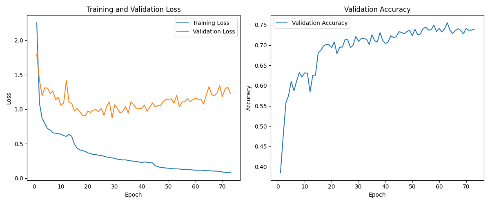

# **街景字符识别（Street View Character Recognition）**


[](https://pytorch.org/hub/nvidia_deeplearningexamples_efficientnet/)
[](https://www.mit.edu/)

---

## 📋目录

- 🌟[项目介绍](#项目介绍)
- 📊[数据集说明](#数据集说明)
- 📁[文件夹结构](#文件夹结构)
- 🧠[模型架构实现](#模型架构实现)
- 🚀[快速开始](#快速开始)
- 📈[结果展示](#结果展示)

## 一、项目介绍

### 1.1 任务背景

街景字符识别是计算机视觉与自然语言处理交叉领域的经典任务，核心目标是从街景图像（如交通标识、门牌号、店铺招牌等）中自动提取并识别字符序列。该技术广泛应用于：

*   智能交通：车牌识别、交通标识解读

*   地图服务：门牌号自动采集与地图更新

*   智慧城市：街道设施编号统计、商业招牌合规检测

*   机器人导航：室内外场景下的位置定位辅助

本项目针对街景图像中字符长度不固定、字体多样、背景复杂（如光照变化、遮挡、模糊）等问题，设计了基于 **EfficientNet-B7 + Transformer + CTC 损失** 的端到端识别方案，实现高精度、鲁棒性强的字符序列预测。

### 1.2 核心技术特点

*   **数据增强策略**：结合保持宽高比的 Resize、颜色抖动、随机仿射变换、高斯模糊，提升模型泛化能力
*   **双阶段特征建模**：用 EfficientNet-B7 提取图像局部特征，Transformer 捕捉字符间的序列依赖关系
*   **不定长序列处理**：基于 CTC 损失解决输入（图像特征序列）与输出（字符序列）的长度对齐问题，无需手动标注字符位置
*   **训练优化机制**：包含学习率预热、梯度裁剪、早停（Early Stopping）、权重衰减、学习率自适应调整（ReduceLROnPlateau），避免过拟合与训练不稳定

==本项目源于：[【AI入门系列】城市探险家：街景字符识别学习赛](https://tianchi.aliyun.com/competition/entrance/531795/information)==

## 二、数据集说明

### 2.1 数据集结构

该数据来自真实场景的门牌号。训练集数据包括3W张照片，验证集数据包括1W张照片，每张照片包括颜色值的编码类别和具体位置；为了保证比赛的公平性，测试集A包括4W张照片，测试集B包括4W张照片。


项目使用街景字符专用数据集，分为训练集、验证集、测试集三部分，目录结构如下：

```
data/
├── mchar_train/       # 训练集图像（.png/.jpg格式）
├── mchar_val/         # 验证集图像（.png/.jpg格式）
├── mchar_test_a/      # 测试集图像（.png/.jpg格式）
├── mchar_train.json   # 训练集标注文件
└── mchar_val.json     # 验证集标注文件
```

### 2.2 标注格式

所有的数据（训练集、验证集和测试集）的标注使用JSON格式，并使用文件名进行索引。如果一个文件中包括多个字符，则使用列表将字合。

<table><tr><td>Field</td><td>Description</td></tr><tr><td>top</td><td>左上角坐标Y</td></tr><tr><td>height</td><td>字符高度</td></tr><tr><td>left</td><td>左上角坐标X</td></tr><tr><td>width</td><td>字符宽度</td></tr><tr><td>label</td><td>字符编码</td></tr></table>

注：数据集来源自SVHN，并进行匿名处理和噪音处理

**示例标注**：

```json
{
    "000000.png": {
        "height": [
            219,
            219
        ],
        "label": [
            1,
            9
        ],
        "left": [
            246,
            323
        ],
        "top": [
            77,
            81
        ],
        "width": [
            81,
            96
        ]
    },
    ...
}
```

### 2.3 数据预处理

代码中实现了针对街景字符的专用预处理逻辑：

1.  **保持宽高比的 Resize**：通过`AspectRatioPreservingResize`类，先按比例缩放图像至目标尺寸（默认 64×256），再用黑色像素填充空白区域，避免字符拉伸变形

2.  **训练集增强**：

*   颜色抖动（亮度 / 对比度 / 饱和度 ±20%）

*   随机仿射（旋转 ±5°、平移 ±10%、缩放 0.9-1.1 倍）

*   随机高斯模糊（概率 20%，核大小 3）

1.  **标准化**：使用 ImageNet 数据集的均值（\[0.485, 0.456, 0.406]）和标准差（\[0.229, 0.224, 0.225]）对图像归一化

2.  **标签处理**：将字符序列填充至最大长度（默认 10），填充值为 - 1，用于后续 CTC 损失计算


## 三、文件夹结构

```makefile
Street_Character_Recognition/
├── data/                   # 存放数据集和标注文件的目录
    ├── README-data.md      # 数据集说明文档
    ├── images/            # 图像文件目录
    ├── mchar_test_a/      # 测试集A图像
    ├── mchar_train/       # 训练集图像
    │   ├── 000000.png
    │   ├── 000001.png
    │   └── ...            # 其他训练图像
    ├── mchar_train.json   # 训练集标注文件
    ├── mchar_val/         # 验证集图像
        ├── 000000.png     # 验证图像样本
        ├── 000001.png
        └── ... 
    └── mchar_val.json     # 验证集标注文件
├── log/                   # 日志文件目录
├── output/
    ├── model/
    ├── pic/
    └── submission.csv     # 预测结果提交文件
├── README.md
├── requirements.txt
└── train.py               # 主训练脚本
```


## 四、模型架构实现

### 4.1 整体框架

模型采用「CNN 特征提取 + Transformer 序列建模 + CTC 解码」的三阶段架构，具体流程如下：

```
输入图像（64×256×3）→ EfficientNet-B7（提取局部特征）→ 自适应池化 → 卷积降维 → 位置编码 → Transformer编码器 → 全连接层（输出logits）→ CTC损失计算/解码
```

### 4.2 各模块细节

#### 4.2.1 CNN 特征提取（EfficientNet-B7）

*   基于预训练的 EfficientNet-B7 模型（仅使用`features`部分，即卷积层 + 批归一化 + 激活函数），不包含顶层分类头

*   作用：将 2D 图像转换为高维局部特征图，默认输出特征图尺寸为「批大小 × 2560 × 2 × 8」（通道数 2560，高度 2，宽度 8）

*   优化：通过`AdaptiveAvgPool2d((1, None))`将高度压缩至 1，得到「批大小 × 2560 × 1 × 8」的序列特征

#### 4.2.2 特征降维与位置编码

*   卷积降维：用 1×1 卷积将特征通道数从 2560 降至 512（减少 Transformer 计算量），配合批归一化、ReLU 激活和 Dropout（概率 0.3）

*   位置编码：采用正弦余弦位置编码（`PositionalEncoding`类），向特征中注入序列顺序信息，公式如下：


    *   偶数维度：`pe(pos, 2i) = sin(pos / 10000^(2i/d_model))`
    
    *   奇数维度：`pe(pos, 2i+1) = cos(pos / 10000^(2i/d_model))`
    
    *   其中`pos`为序列位置，`d_model`为特征维度（512）

#### 4.2.3 Transformer 编码器

*   编码器层配置：


    *   层数：3 层（可通过`config.transformer_layers`调整）
    
    *   多头注意力头数：8 头（`config.num_heads`）
    
    *   前馈网络维度：512×4=2048
    
    *   激活函数：GELU（更适合 Transformer 的非线性激活）
    
    *   Dropout：0.3（防止过拟合）

*   输入格式：「序列长度 × 批大小 × 特征维度」（默认 8×32×512）

*   作用：捕捉字符间的长距离依赖关系，例如 "123" 中 "1" 与 "3" 的序列关联

#### 4.2.4 损失计算与解码

*   **CTC 损失**：


    *   空白符（blank token）：设置为第 10 类（因字符为 0-9，共 10 类）
    
    *   输入：模型输出的 logits（批大小 × 序列长度 × 11），需先做 log softmax
    
    *   处理：自动对齐输入序列（特征序列）与输出序列（字符序列），解决长度不匹配问题

*   **解码逻辑**：


    *   步骤 1：对 logits 取.argmax () 得到预测类别索引
    
    *   步骤 2：移除连续重复的类别（如 "112"→"12"）
    
    *   步骤 3：过滤空白符（第 10 类），得到最终字符序列

### 4.3 模型参数

*   可训练参数总量：约 1.2 亿（主要来自 EfficientNet-B7 预训练层微调与 Transformer 层）

*   关键超参数（在`Config`类中配置）：

| 参数名              | 默认值      | 作用                   |
| ---------------- | -------- | -------------------- |
| batch\_size      | 32       | 批处理大小                |
| num\_epochs      | 100      | 最大训练轮数               |
| learning\_rate   | 0.0005   | 初始学习率                |
| patience         | 10       | 早停耐心值（连续 10 轮无提升则停止） |
| image\_size      | (64,256) | 图像目标尺寸（高 × 宽）        |
| max\_seq\_length | 10       | 字符序列最大长度             |
| dropout          | 0.3      | Dropout 概率           |
| warmup\_steps    | 1000     | 学习率预热步数              |


## 五、快速开始

### 5.1 环境配置

#### 5.1.1 依赖库安装

```bash
pip install -r requirements.txt
```

#### 5.1.2 硬件要求

*   推荐 GPU：NVIDIA Tesla P100/V100/A100（显存≥16GB，支持 CUDA 12.0+）

*   若 GPU 显存不足：可减小`batch_size`（如 16）、降低`image_size`（如 48×192）或减少 Transformer 层数

### 5.2 数据准备

1.  下载街景字符数据集，按「2.1 数据集结构」整理目录

2.  修改`main()`函数中的数据路径（需根据实际路径调整）：

```python
# 原始路径（Kaggle环境示例）
train_img_dir = '/kaggle/input/street-character-recognition/data/mchar_train'
val_img_dir = '/kaggle/input/street-character-recognition/data/mchar_val'
test_img_dir = '/kaggle/input/street-character-recognition/data/mchar_test_a'
train_ann_file = '/kaggle/input/street-character-recognition/data/mchar_train.json'
val_ann_file = '/kaggle/input/street-character-recognition/data/mchar_val.json'
```

### 5.3 模型训练

1.  直接运行主脚本：

```bash
python train.py
```

1.  训练过程输出：

*   实时进度：每轮训练的批处理损失（通过 tqdm 显示）

*   轮次总结：训练损失、验证损失、验证准确率、当前学习率

*   模型保存：当验证准确率提升时，自动保存`best_model.pth`（路径：`/kaggle/working/`）

*   早停触发：若连续 10 轮验证准确率无提升，自动停止训练

### 5.4 预测与提交

#### 5.4.1 测试集预测

训练完成后，代码会自动加载`best_model.pth`，对测试集（`mchar_test_a`）进行预测，并生成提交文件`submission.csv`，格式如下：

| file\_name | file\_code |
| ---------- | ---------- |
| 00001.jpg  | 123        |
| 00002.jpg  | 45         |

#### 5.4.2 随机样本验证

代码内置`test_random_samples()`函数，训练后会随机选取 10 个验证集样本，输出预测结果与真实标签的对比，示例如下：

```makefile
随机样本测试结果:
==================================================
样本 1:
预测: 5
真实: 5
正确: True
------------------------------
样本 2:
预测: 240
真实: 210
正确: False
------------------------------
样本 3:
预测: 96
真实: 6
正确: False
------------------------------
样本 4:
预测: 1
真实: 1
正确: True
...
随机样本准确率: 70.00%
```

## 六、结果展示

训练过程中会生成以下文件，用于分析模型性能：

1.  **训练历史文件**：`training_history.csv`，包含每轮的训练损失、验证损失、验证准确率、学习率，可用于二次分析

2.  **训练曲线图片**：`training_curves.png`，包含两个子图：

*   左图：训练损失与验证损失变化趋势（若验证损失先降后升，说明过拟合）

*   右图：验证准确率变化趋势（目标是持续上升，直至收敛）



在验证集上随机抽样10个进行测试得到的 输出图像如下：


